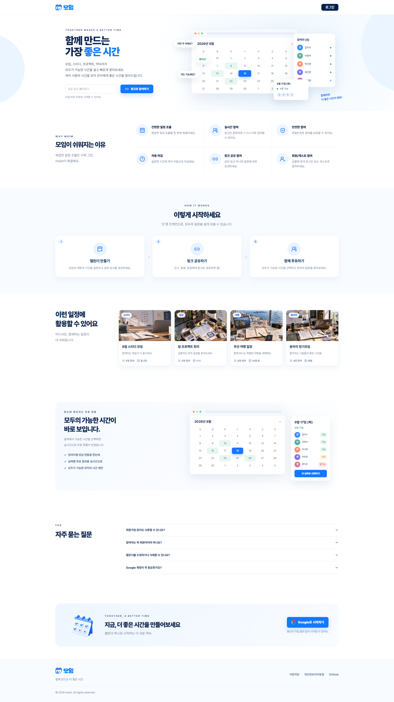
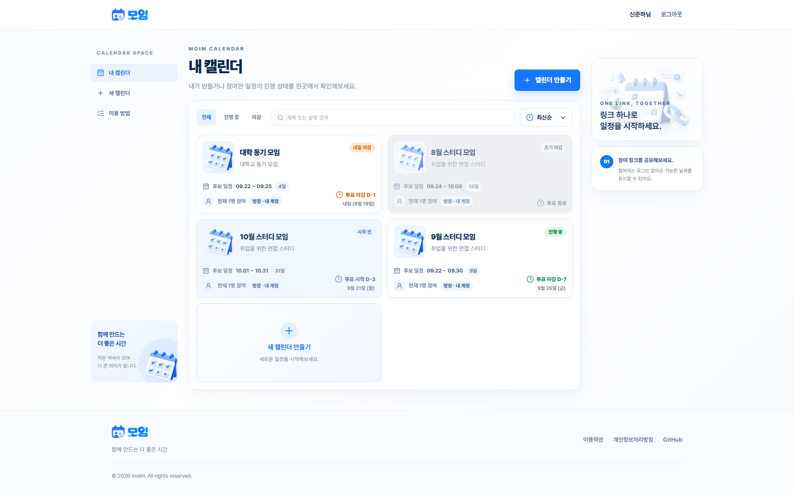
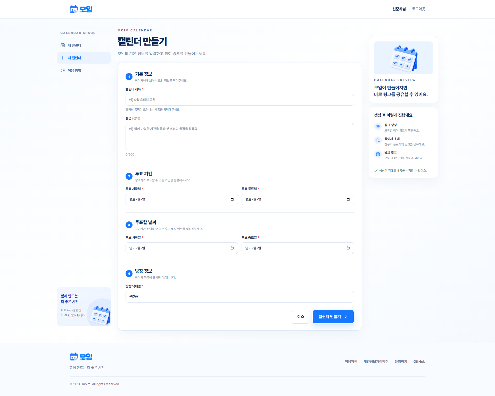
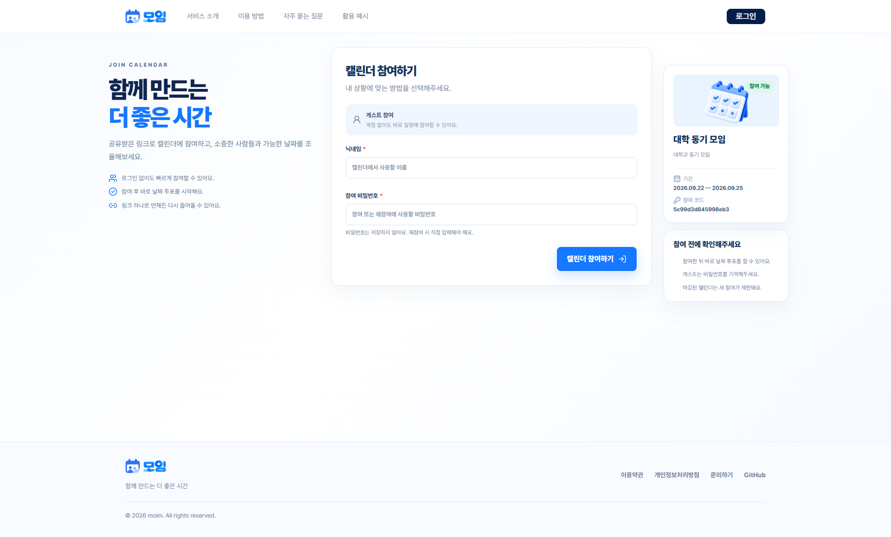
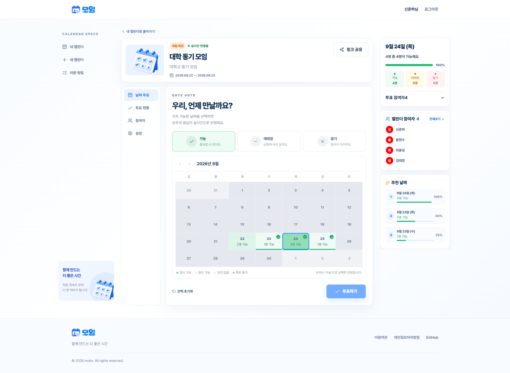
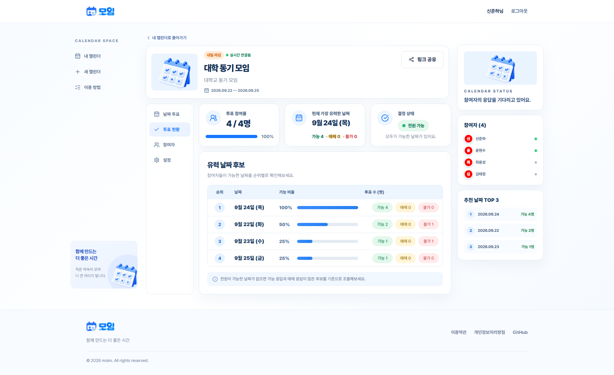
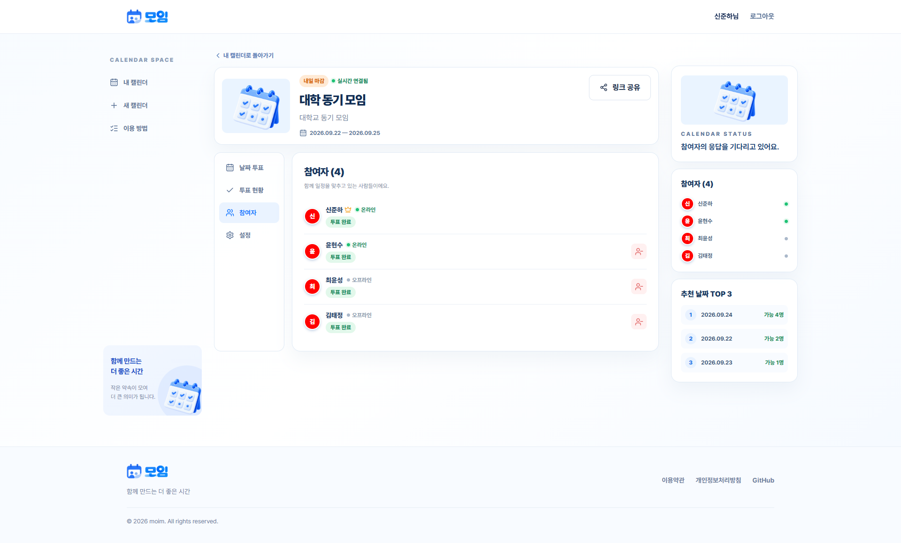
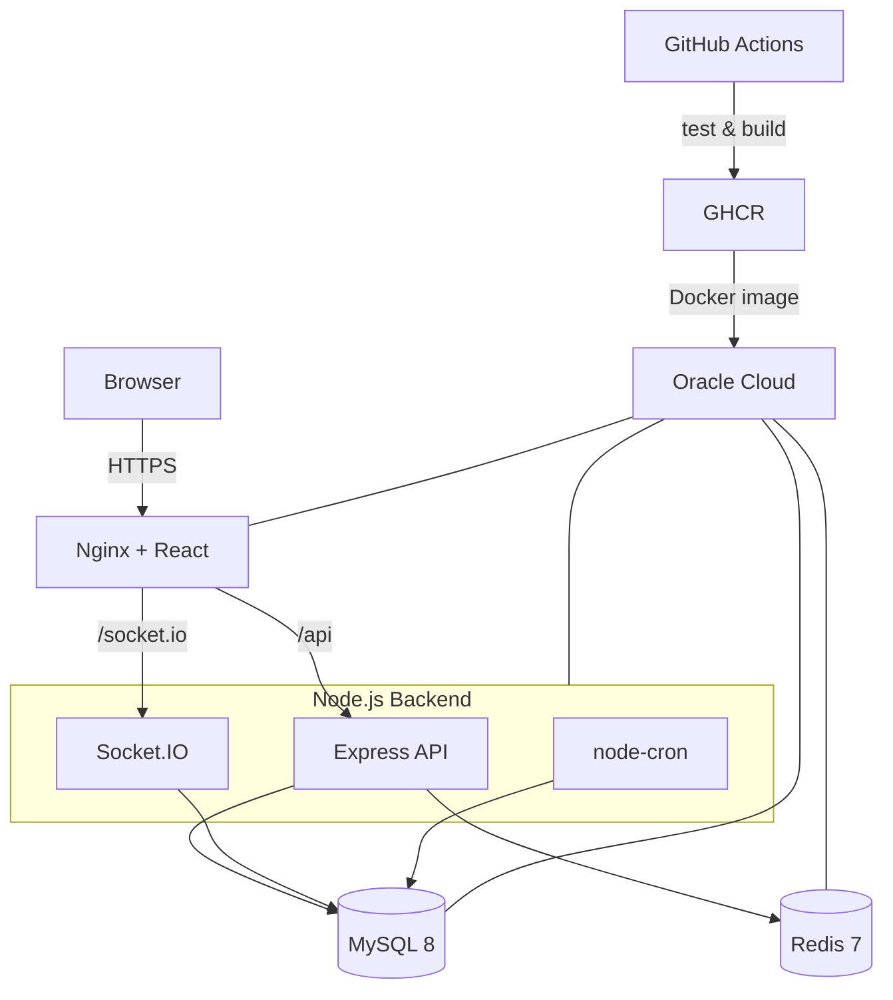

# moim

> 링크 하나로 참여하는 실시간 일정 조율 서비스
>
> 방장이 후보 날짜와 투표 기간을 정해 캘린더를 만들면, 참여자들이 회원 또는 게스트로 들어와 가능한 날짜를 투표하고 결과를 실시간으로 확인할 수 있습니다.


---

## 스크린샷

<!--
아래 8개 화면을 docs/images 아래에 추가한 뒤 이 주석을 표로 교체하세요.
브라우저 주소창과 테스트용 개인정보는 제외하고, 데스크톱은 같은 1440px 폭으로 맞추는 것을 권장합니다.

| 홈 | 내 캘린더 | 캘린더 만들기 | 링크 참여 |
|:---:|:---:|:---:|:---:|
|  |  |  |  |

| 날짜 투표 | 투표 현황 | 참여자 | 모바일 홈 |
|:---:|:---:|:---:|:---:|
|  |  |  |  |

촬영 상태:
1. 홈: Hero의 공유 링크 입력과 Feature Grid가 함께 보이는 비로그인 데스크톱 화면
2. 내 캘린더: 상태가 다른 카드가 4개 이상 있고 정렬 드롭다운을 연 화면
3. 캘린더 만들기: 투표 기간과 후보 날짜 기간이 모두 보이는 입력 화면
4. 링크 참여: 로그인 상태에서 계정 이름/별명 선택지가 보이는 화면
5. 날짜 투표: 히트맵 달력과 오른쪽 날짜 상세·추천 날짜 패널이 함께 보이는 화면
6. 투표 현황: 참여율·유력 날짜·결정 상태 카드와 유력 후보 표가 함께 보이는 화면
7. 참여자: 방장·온라인 상태·투표 완료 여부가 함께 보이는 참여자 탭
8. 모바일 홈: 390px 안팎 폭에서 Hero와 2열 Feature Grid가 보이는 화면
-->

---

## 문제 정의

여러 사람이 만날 날짜를 정할 때는 메신저에 가능한 날짜를 반복해서 올리고, 뒤늦게 들어온 응답을 다시 합산해야 합니다. 참여자가 많아질수록 누가 응답했는지, 어느 날짜가 유력한지, 투표가 언제 끝나는지 관리하기 어려워집니다.

## 해결 방향

일정 조율에 필요한 흐름을 **캘린더 생성 → 링크 공유 → 참여 → 날짜별 투표 → 결과 확인**으로 단순화했습니다. 회원가입하지 않은 사람도 게스트로 참여할 수 있고, 투표·접속 상태·캘린더 변경은 Socket.IO를 통해 같은 캘린더를 보고 있는 사용자에게 전달됩니다.

---

## 주요 기능

- **링크 기반 참여** — 공유 링크만으로 캘린더 정보를 확인하고 회원 또는 게스트로 참여
- **네 가지 투표 상태** — 날짜마다 가능·미정·불가능·미투표를 구분해 저장
- **실시간 반영** — 투표, 접속 상태, 캘린더 수정·마감·삭제 이벤트를 Socket.IO로 전달
- **투표 현황 시각화** — 날짜별 가능 비율과 응답 수를 비교하고 유력 후보를 최대 5개까지 표시
- **회원·게스트 재입장** — 회원 참여는 계정으로 복원하고, 비회원 참여는 별명과 비밀번호로 재입장
- **게스트 기록 연결** — 비회원으로 투표한 뒤 로그인해도 기존 기록을 계정 또는 별명 프로필에 연결
- **캘린더 관리** — 방장이 후보 날짜, 투표 기간, 제목과 설명을 수정하고 참여자 강퇴·조기 마감·삭제 수행
- **자동 운영** — 투표 종료일 다음 날 자동 마감하고 보관 기간이 지난 캘린더를 자동 삭제
- **공휴일 정보** — 공공데이터 API에서 공휴일·기념일 정보를 동기화해 캘린더에 표시
- **반응형 UI** — 홈, 캘린더 목록, 참여, 투표 화면을 모바일·태블릿·데스크톱에 맞게 구성

## 사용자 흐름

1. 방장이 Google 계정으로 로그인합니다.
2. 후보 날짜와 투표 기간을 입력해 캘린더를 만듭니다.
3. 생성된 링크를 참여자에게 공유합니다.
4. 참여자는 계정 이름, 별명 또는 비회원 게스트로 들어옵니다.
5. 날짜마다 가능·미정·불가능을 선택하고 투표합니다.
6. 모든 참여자가 실시간으로 투표 현황과 유력 날짜를 확인합니다.
7. 방장이 직접 마감하거나 투표 기간 종료 후 시스템이 자동 마감합니다.

---

## 기술 스택

| 구분 | 기술 | 용도 |
|------|------|------|
| **프론트엔드** | React 19 · TypeScript · Vite 7 | SPA와 개발·빌드 환경 |
| | React Router | 홈, 인증, 캘린더 목록·상세·참여 라우팅 |
| | TanStack Query | 서버 상태 캐시, 재조회, mutation 이후 동기화 |
| | React Hook Form · Zod | 캘린더·참여 폼 상태와 입력 검증 |
| | Tailwind CSS 4 | 반응형 UI와 공통 디자인 토큰 |
| | Socket.IO Client | 투표·참여자·마감 이벤트 수신 |
| **백엔드** | Node.js 20 · Express · TypeScript | REST API와 애플리케이션 서버 |
| | Socket.IO | 캘린더별 실시간 이벤트 브로드캐스트 |
| | MySQL 8 | 사용자·캘린더·참가자·투표 데이터 저장 |
| | Redis 7 | Refresh Token 폐기, Rate Limit 등 단기 상태 저장 |
| | Joi | 요청 params·query·body 검증 |
| | node-cron | 자동 마감, 만료 데이터 삭제, 공휴일 동기화 |
| | Jest · Supertest | 단위·통합·HTTP·Socket 회귀 테스트 |
| **인프라 / DevOps** | Docker · Docker Compose | 애플리케이션과 MySQL·Redis 실행 |
| | Nginx | React 정적 파일 제공, API·Socket.IO 리버스 프록시, TLS 종료 |
| | GitHub Actions · GHCR | 테스트, 이미지 빌드, 이미지 저장, 운영 배포 |
| | Oracle Cloud | 단일 서버 운영 환경 |

### 기술 선택 이유

- **React Query를 서버 상태의 기준점으로 사용** — 캘린더·참여자·투표 응답을 화면별 로컬 상태에 복제하지 않고 도메인별 query key로 관리합니다.
- **도메인 기반 프론트엔드 구조** — 투표, 참가 세션, 캘린더, 인증 책임을 분리하고 여러 도메인의 조합만 `app` 계층에서 처리합니다.
- **Socket.IO + 재조회 방식** — 이벤트 도착을 변경 신호로 사용하고 최신 데이터는 API에서 다시 확인해 이벤트 순서나 재연결에 따른 불일치를 줄입니다.
- **MySQL 트랜잭션과 행 잠금** — 마감·참여·투표가 동시에 실행되어도 처리 순서가 보장되도록 상태 확인과 변경을 같은 트랜잭션에서 수행합니다.
- **단일 서버 Docker Compose** — 소규모 서비스에서 운영 복잡도를 낮추면서도 프론트엔드, 백엔드, DB, Redis의 실행 환경을 분리했습니다.

---

## 아키텍처



### 설계 원칙

- **서버 응답을 기준으로 판단** — 프론트의 라우트 가드와 토큰 해석은 사용자 경험을 위한 보조 수단이며, 최종 권한은 백엔드와 DB에서 확인합니다.
- **회원 인증과 참가 인증 분리** — 회원용 Main Token과 캘린더 참가자용 Participant Token을 역할에 맞게 사용합니다.
- **날짜와 시각 구분** — 투표 날짜는 KST 날짜 값으로 판정하고, 서버 timestamp와 로그는 UTC로 저장한 뒤 화면에서 KST로 표시합니다.
- **편집본 보호** — 서버 재조회나 다른 사용자의 실시간 투표가 저장하지 않은 내 선택을 덮어쓰지 않도록 서버 상태와 편집 상태를 분리합니다.
- **실패 원인 구분** — 인증 만료와 Redis·네트워크 장애를 구분해 일시적인 장애를 강제 로그아웃으로 처리하지 않습니다.

### 프로젝트 구조

```text
Calendar_project/
├─ frontend/
│  ├─ src/
│  │  ├─ app/                 # Router, Provider, Guard, 페이지 조합
│  │  ├─ domains/             # auth, user, calendar, participant, vote
│  │  └─ shared/              # API·Socket transport, 공통 UI와 유틸
│  ├─ nginx/                  # 운영 Nginx 템플릿
│  └─ docs/                   # 페이지 명세, 아키텍처, 연동 계약
│
├─ back-end/
│  ├─ src/
│  │  ├─ controllers/         # HTTP 요청·응답 처리
│  │  ├─ services/            # 도메인 로직과 트랜잭션 흐름
│  │  ├─ repositories/        # MySQL·Redis 데이터 접근
│  │  ├─ middlewares/         # 인증, 검증, CORS, Rate Limit, 오류 처리
│  │  ├─ routes/              # REST API 라우터
│  │  ├─ sockets/             # Socket.IO 인증과 이벤트 처리
│  │  ├─ infrastructure/      # 트랜잭션 관리
│  │  ├─ models/              # 도메인 모델, DTO, DB 스키마
│  │  └─ __tests__/           # 단위·통합 회귀 테스트
│  └─ docker-compose.ci.yml   # 테스트용 MySQL·Redis
│
├─ deploy/                    # TLS, 백업, 배포 스크립트와 운영 문서
├─ .github/workflows/         # CI 이미지 빌드와 운영 배포
└─ compose.production.yml     # 운영 전체 구성
```

### 핵심 도메인 처리

- **투표 전체 교체** — 한 번의 요청이 참가자의 전체 투표 목록을 교체합니다. 빠진 날짜는 투표 취소이며 `불가능`과 `미투표`는 별도 상태입니다.
- **투표 저장 직렬화** — 캘린더, 참가자, 날짜 옵션을 정해진 순서로 잠그고 교체하며 데드락 발생 시 전체 트랜잭션을 재시도합니다.
- **참여와 마감 동시성** — 캘린더 행 잠금으로 신규 참여와 마감의 처리 순서를 보장합니다. 마감이 먼저 끝났다면 신규 참가자는 등록되지 않습니다.
- **자동 마감 재검증** — 크론이 조회한 ID만 믿지 않고 실제 마감 트랜잭션에서 종료일과 상태를 다시 확인합니다.
- **게스트 기록 정리** — 로그인 전 게스트 기록과 계정 기록이 함께 존재하면 한쪽의 전체 투표를 선택하거나 게스트 참가자를 계정에 연결합니다.

---

## 안정성과 보안

- **분리된 JWT** — 회원 Access Token, Participant Token, Refresh Token에 서로 다른 secret과 검증 경계를 적용합니다.
- **Refresh Cookie** — Refresh Token은 HttpOnly 쿠키로 전달하고 로그아웃·폐기 상태는 Redis에서 관리합니다.
- **권한 재검증** — 캘린더 수정·삭제·마감·강퇴는 Main Token과 DB의 실제 소유자를 함께 확인합니다.
- **Socket 재입장 검증** — 방 입장마다 참가자 존재 여부, 캘린더 소속, 토큰 유효성을 다시 검사합니다.
- **강퇴 연결 정리** — 참가자 UUID에 연결된 모든 Socket을 종료해 기존 연결을 이용한 재입장을 차단합니다.
- **Rate Limit 분리** — 신규 게스트 생성과 기존 참가자의 비밀번호 실패를 구분해 정상적인 다중 참여가 로그인 실패 제한에 걸리지 않도록 했습니다.
- **입력과 HTTP 보호** — Joi 검증, Helmet, CORS 허용 Origin·Header 제한, 요청 크기 제한을 적용합니다.
- **시크릿 관리** — JWT, OAuth, DB 비밀번호는 환경변수로만 주입하며 운영 파일은 Git에서 제외합니다.

---

## CI/CD와 테스트

### CI

`main` 대상 Pull Request와 push에서 프론트엔드와 백엔드 테스트를 병렬 실행합니다.

- **Frontend** — Vitest 테스트
- **Backend** — 임시 MySQL·Redis 컨테이너 기동 후 Jest 테스트
- **Images** — 두 테스트가 모두 통과하면 프론트엔드·백엔드 Docker 이미지 빌드
- **Registry** — `main` push에서는 전체 Git SHA와 `latest` 태그로 GHCR에 업로드

### CD

배포 워크플로에 GHCR 이미지의 전체 Git SHA를 입력하면 SSH로 Oracle Cloud 서버에 접속해 설정을 갱신하고 다음 순서로 배포합니다.

```text
compose pull → compose up -d → HTTPS health check → backend readiness check
```

운영 서버에서는 소스 빌드나 테스트를 실행하지 않고 GitHub Actions가 만든 이미지만 실행합니다.

---

## 로컬 실행 방법

### 사전 준비

- Node.js 20 이상 — 백엔드
- Node.js 22 이상 — 프론트엔드
- npm 10 이상
- Docker Desktop
- Google OAuth Client
- 공공데이터포털 특일 정보 API 서비스 키

### 1. 백엔드 환경변수 설정

`back-end/.env`를 만들고 필요한 값을 입력합니다.

```env
PORT=3000
NODE_ENV=development

MAIN_JWT_SECRET=replace-with-a-long-random-value
PARTICIPANT_JWT_SECRET=replace-with-another-long-random-value
REFRESH_JWT_SECRET=replace-with-another-long-random-value
SESSION_SECRET=replace-with-another-long-random-value
SIGNUP_MODE=immediate
ENABLE_RATE_LIMIT=false
GENERAL_RATE_LIMIT_MAX=600

DB_HOST=127.0.0.1
DB_USER=calendar_user
DB_USER_PASSWORD=calendar_password
DB_ROOT_PASSWORD=replace-with-a-root-password
DB_NAME=calendar_db
DB_CONNECTION_LIMIT=10

REDIS_URL=redis://127.0.0.1:6379
CLIENT_URL=http://localhost:8080
BACKEND_URL=http://localhost:3000

GOOGLE_CLIENT_ID=replace-with-google-client-id
GOOGLE_CLIENT_SECRET=replace-with-google-client-secret
GET_REST_DE_INFO=replace-with-public-data-service-key
```

Google OAuth의 승인된 리디렉션 URI에는 다음 주소를 등록합니다.

```text
http://localhost:8080/auth/callback
```

### 2. MySQL과 Redis 실행

```bash
cd back-end
docker compose up -d db redis
```

### 3. 백엔드 실행

```bash
cd back-end
npm install
npm run dev
```

백엔드는 기본적으로 `http://localhost:3000`에서 실행됩니다.

### 4. 프론트엔드 실행

```bash
cd frontend
cp .env.example .env
npm install
npm run dev
```

프론트엔드는 `http://localhost:8080`에서 실행되며 `.env`에 지정한 로컬 백엔드의 API와 Socket.IO에 직접 연결합니다.

### 테스트와 빌드

프론트엔드:

```bash
cd frontend
npm run typecheck
npm test
npm run build
```

백엔드:

```bash
cd back-end
docker compose -f docker-compose.ci.yml up -d --wait
npm test
npm run build
docker compose -f docker-compose.ci.yml down --volumes
```

---

## API와 문서

- **Swagger UI** — 로컬 서버 실행 후 `http://localhost:3000/api/v1/api-docs`
- **[프론트엔드 README](frontend/README.md)** — 실행 방법과 디렉터리 구조
- **[프론트엔드 아키텍처](frontend/docs/FRONTEND_ARCHITECTURE.md)** — 계층과 상태 소유권
- **[프론트엔드 연동 계약](frontend/docs/FRONTEND_CONTRACTS.md)** — 인증·투표·Socket 동작
- **[화면 명세](frontend/docs/MOIM_PAGE_SPEC.md)** — 페이지별 UI와 상태
- **[백엔드 README](back-end/README.md)** — API, 인증, DB, 크론 상세
- **[운영 배포 가이드](deploy/README.md)** — TLS, GHCR 배포, 백업과 운영 확인

---

## 향후 개선 계획

- 실제 Google OAuth를 포함한 주요 사용자 흐름을 브라우저 E2E 테스트로 자동화할 예정입니다.
- 운영 환경의 백업 복구 연습과 장애 알림을 정기화할 예정입니다.
- 사용량이 늘어나면 API 서버와 배치 작업을 분리하고 다중 인스턴스 환경의 Socket.IO 확장을 검토할 예정입니다.
