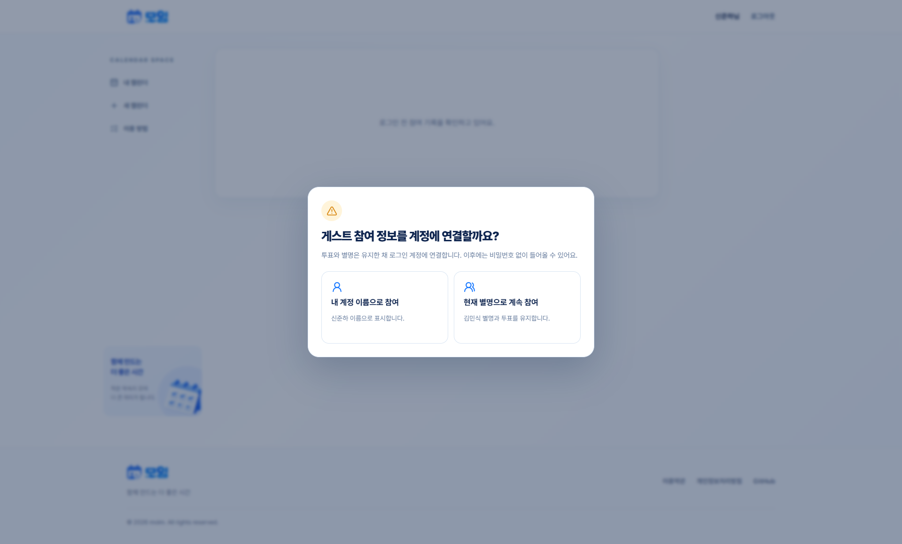
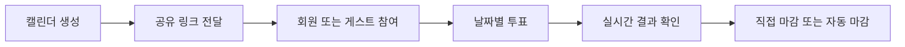
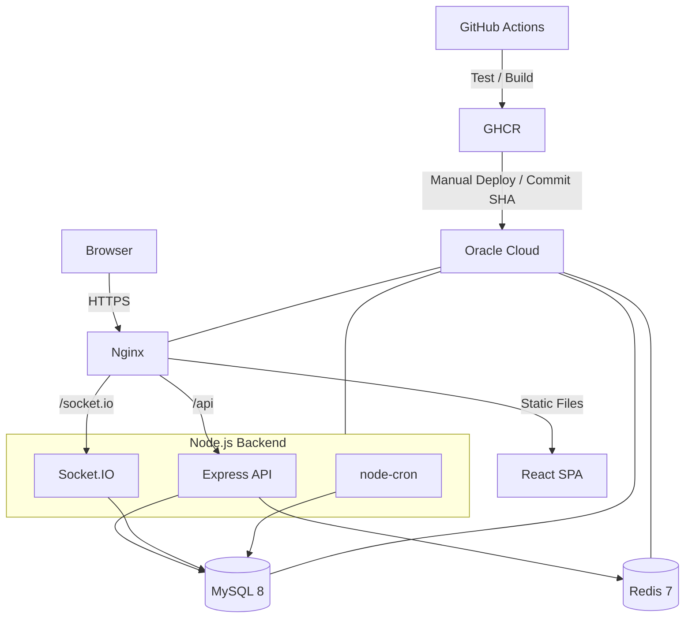
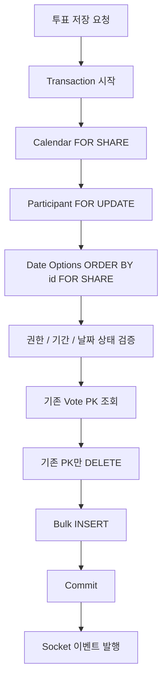
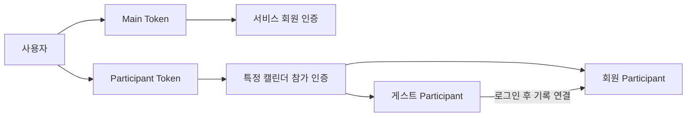
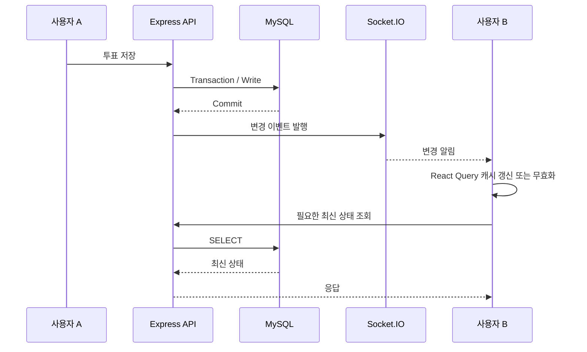
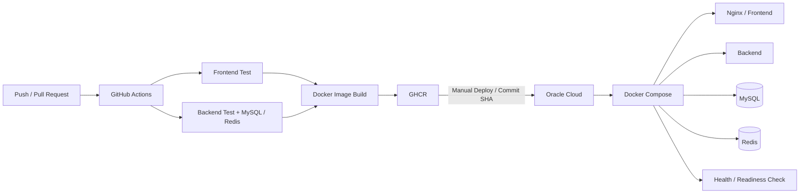
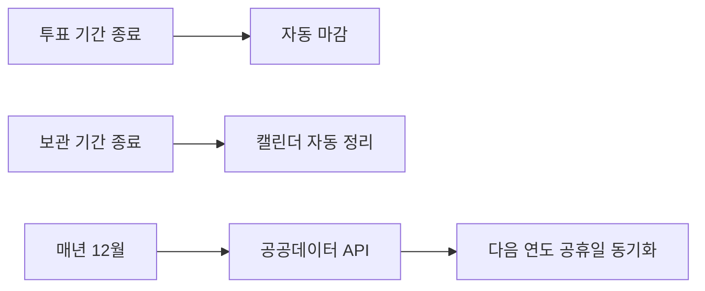

# moim

> 링크 하나로 참여하는 실시간 일정 조율 서비스

방장이 후보 날짜와 투표 기간을 정해 캘린더를 만들면, 참여자들이 회원 또는 게스트로 들어와 가능한 날짜를 투표하고 결과를 실시간으로 확인할 수 있습니다.


---

## Screenshots

|                       홈                        |                        내 캘린더                         |                        캘린더 생성                         |                        링크 참여                         |
| :---------------------------------------------: | :------------------------------------------------------: | :--------------------------------------------------------: | :------------------------------------------------------: |
|  |  |  |  |

|                      날짜 투표                       |                       투표 현황                        |                         참여자                          |                        게스트 기록 연결                         |
| :--------------------------------------------------: | :----------------------------------------------------: | :-----------------------------------------------------: | :-------------------------------------------------------------: |
|  |  |  |  |

---

## 문제 정의

여러 사람이 만날 날짜를 정할 때는 메신저에 가능한 날짜를 반복해서 올리고, 늦게 들어온 응답을 다시 합산해야 합니다.

참여자가 많아질수록 다음 문제가 커집니다.

- 누가 응답했는지 확인하기 어려움
- 가능한 날짜를 다시 취합해야 함
- 투표 마감 시점을 따로 관리해야 함
- 여러 사용자의 수정이 동시에 발생할 수 있음
- 비회원 참여 기록을 다시 찾기 어려움

moim은 이 흐름을 **캘린더 생성 → 링크 공유 → 참여 → 날짜별 투표 → 결과 확인 → 마감**으로 단순화했습니다.



---

## 주요 기능

- 공유 링크 기반 캘린더 참여
- 회원 / 비회원 게스트 참여
- 가능 / 미정 / 불가능 / 미투표 상태 관리
- Socket.IO 기반 실시간 투표 및 참여 상태 반영
- 회원·게스트 재입장
- 게스트 기록과 회원 계정 연결
- 후보 날짜 및 투표 기간 수정
- 참여자 강퇴
- 조기 마감 / 자동 마감
- 만료 데이터 자동 정리
- 공공데이터 API 기반 공휴일 동기화
- 모바일 / 태블릿 / 데스크톱 대응

---

## 기술 스택

| 구분         | 기술                           | 용도                                 |
| ------------ | ------------------------------ | ------------------------------------ |
| **Frontend** | React 19 · TypeScript · Vite 7 | SPA                                  |
|              | React Router                   | Routing                              |
|              | TanStack Query                 | Server state                         |
|              | React Hook Form · Zod          | Form / Validation                    |
|              | Tailwind CSS 4                 | UI                                   |
|              | Socket.IO Client               | Realtime event                       |
| **Backend**  | Node.js · Express · TypeScript | REST API                             |
|              | Socket.IO                      | Realtime                             |
|              | MySQL 8                        | Persistent data                      |
|              | Redis 7                        | Token blacklist / Rate limit         |
|              | Joi                            | Request validation                   |
|              | node-cron                      | Automatic jobs                       |
|              | Jest · Supertest               | Test                                 |
| **Infra**    | Docker · Docker Compose        | Container                            |
|              | Nginx                          | Static serving / Reverse proxy / TLS |
|              | GitHub Actions · GHCR          | CI / Image build / Registry          |
|              | Oracle Cloud                   | Production server                    |

---

# System Architecture



외부에는 Nginx만 공개하고 Backend, MySQL, Redis는 Docker 내부 네트워크에서 통신합니다.

Nginx는 React 정적 파일을 제공하고 `/api`와 `/socket.io` 요청을 백엔드로 전달합니다.

---

## Backend Layer

```text
Route → Controller → Service → Repository → MySQL / Redis
```

- **Controller**: HTTP 요청과 응답 처리
- **Service**: 비즈니스 규칙과 유스케이스 조정
- **Repository**: SQL과 데이터 접근, 투표 전체 교체처럼 저장 단위가 명확한 트랜잭션 처리
- **Infrastructure**: 여러 저장소를 묶는 공통 트랜잭션 및 인프라

ORM 대신 `mysql2`를 사용해 SQL과 트랜잭션 흐름을 직접 제어합니다.

---

## Frontend Architecture

프론트엔드는 기능 단위의 도메인 구조로 구성했습니다. 화면 조합과 앱 전역 관심사는 `app`, 기능별 책임은 `domains`, 특정 도메인을 모르는 범용 코드는 `shared`에 둡니다.

```text
src/
├─ app/
│  ├─ router/
│  ├─ providers/
│  ├─ guards/
│  └─ pages/          # 여러 도메인을 조합하는 라우트 페이지
├─ domains/
│  ├─ auth/
│  ├─ user/
│  ├─ calendar/
│  ├─ participant/
│  └─ vote/
└─ shared/
   ├─ api/
   ├─ socket/
   ├─ ui/
   ├─ hooks/
   ├─ utils/
   ├─ constants/
   └─ types/
```

의존 방향은 다음처럼 한쪽으로 유지합니다.

```text
main → app → domain pages / ui / hooks → domain api / model → shared
```

- **app**: Router, Provider, Guard와 여러 도메인의 조합을 담당
- **domains**: 인증, 캘린더, 참가자, 투표처럼 기능별 API·상태·UI 책임을 소유
- **shared**: HTTP, Socket transport, 범용 UI·유틸처럼 도메인에 의존하지 않는 코드만 배치
- 도메인끼리 직접 import하지 않고, 여러 도메인을 연결해야 하는 경우 `app/pages` 또는 `app/providers`에서 조합
- 도메인 외부에서는 각 도메인이 `index.ts`로 공개한 진입점만 사용

이 구조를 선택한 이유는 화면 규모가 커져도 인증·참가·투표 로직이 페이지 컴포넌트에 뒤섞이지 않게 하고, 기능 단위 변경이 다른 도메인으로 번지는 범위를 줄이기 위해서입니다.

### State Ownership

서버에서 받은 상태와 사용자가 아직 저장하지 않은 편집 상태를 같은 원본으로 취급하지 않습니다.

| 상태                      | 관리 방식                        |
| ------------------------- | -------------------------------- |
| 캘린더·참가자·투표·공휴일 | 각 도메인의 TanStack Query 캐시  |
| 저장 전 폼·투표 선택      | 화면 또는 도메인의 Editing State |
| 투표율·후보 정렬·집계     | Query 캐시에서 파생 계산         |
| 회원 인증 상태            | auth 세션 상태                   |
| 캘린더별 참가 세션        | participant 상태                 |
| 접속 상태·온라인 사용자   | participant의 일시 상태          |

이렇게 분리해 Socket 이벤트나 백그라운드 재조회가 발생해도 사용자가 저장하기 전 선택값을 덮어쓰지 않도록 했습니다. Query 캐시와 같은 데이터를 별도의 전역 상태에 다시 복제하지 않으며, Zustand 같은 전역 상태 도구도 실제 화면 간 공유가 필요한 경우에만 사용합니다.

### Socket Lifecycle

Socket transport 자체는 `shared/socket`에 두고, 연결 생성·교체·해제는 캘린더 상세 페이지의 생명주기에 맞춰 `app`에서 관리합니다. 한 상세 화면에서는 해당 `slug + Participant Token` 기준 연결 하나만 유지하고, 페이지를 벗어나면 listener와 연결을 정리합니다.

Socket 이벤트는 최종 데이터를 직접 소유하는 수단이 아니라 **변경 신호**로 사용하고, 실제 서버 상태는 TanStack Query와 API 응답을 기준으로 갱신합니다.

세부 기준은 [`frontend/docs/FRONTEND_ARCHITECTURE.md`](frontend/docs/FRONTEND_ARCHITECTURE.md)와 [`frontend/docs/FRONTEND_CONTRACTS.md`](frontend/docs/FRONTEND_CONTRACTS.md)에 문서화했습니다.

---

# Engineering Highlights

## 1. 동시 투표 데드락 개선과 이후 동시성 보강

초기 복수 투표 저장은 참가자의 기존 투표를 모두 삭제한 뒤 Bulk INSERT하는 구조였고, `date_option_id` 처리 순서도 고정되어 있지 않았습니다. 동시 요청이 겹치면서 DB 로그에 `Deadlock found when trying to get lock`이 발생했고, 20 VU 테스트에서 실패율이 60%까지 올라갔습니다.

당시에는 DB에 전달하기 전 `date_option_id`를 오름차순으로 정렬하고, 전체 `DELETE → INSERT` 방식 대신 Bulk UPSERT로 전환했습니다. 두 변경을 함께 적용한 뒤 동일 조건 테스트에서 실패율이 0%로 내려갔습니다.

| 지표   |   Before |       After |
| ------ | -------: | ----------: |
| 성공률 |      40% |    **100%** |
| 실패율 |      60% |      **0%** |
| p95    | 324.79ms | **139.8ms** |

이후 날짜별로 `available / maybe / unavailable` 상태를 저장하고, 한 요청이 참가자의 현재 선택 목록 전체를 교체하도록 기능이 확장되면서 저장 경로도 다시 보강했습니다. 현재 구현은 UPSERT에 의존하지 않고 명시적인 잠금 순서와 전체 트랜잭션 재시도로 동시성을 제어합니다.



- 잠금 순서: **Calendar → Participant → Date Option → Vote**
- 같은 참가자의 투표 변경은 `Participant FOR UPDATE`로 직렬화
- 날짜 옵션은 `ORDER BY id FOR SHARE`로 고정된 순서로 접근
- 기존 투표는 PK를 먼저 조회한 뒤 해당 PK만 삭제해 넓은 범위의 DELETE 경합을 줄임
- `ER_LOCK_DEADLOCK` 발생 시 Rollback 후 **전체 트랜잭션을 최대 2회 재시도**

즉, 포트폴리오의 `정렬 + Bulk UPSERT`는 최초 데드락을 해결한 당시 개선 기록이고, 현재 코드는 기능 확장 이후 잠금 순서와 재시도까지 추가한 구조입니다.

---

## 2. 조회 성능 개선

참가자별 투표 현황 조회에서 날짜 옵션과 선택 투표를 반복 조회하던 구간을 `IN` 절 일괄 조회 후 `Map`으로 조립하도록 변경하고, 참가자별 `COUNT`는 별도 집계 쿼리로 분리했습니다.

동일한 300 VU 조건에서 직접적인 개선 전후를 비교한 결과:

| 지표          |      Before |           After |
| ------------- | ----------: | --------------: |
| 평균 응답시간 |       1.10s |       **262ms** |
| p95           |       2.36s |       **742ms** |
| 처리량        | 111.7 req/s | **209.0 req/s** |

평균 응답시간은 약 **76% 단축**됐고, 처리량은 약 **87% 증가**했습니다.

> 초기 baseline에서는 평균 1.24s, p95 6.52s, 105.6 req/s도 관측했지만, 위 표는 현재 포트폴리오에서 설명하는 조회 구조 개선과 직접 대응되는 전후 테스트만 사용했습니다.

---

## 3. 회원 인증과 참가 인증 분리

로그인 여부와 특정 캘린더의 참여 권한은 서로 다른 개념입니다.

로그인하지 않은 게스트도 특정 캘린더에는 참여할 수 있고, 로그인 사용자라고 해서 모든 캘린더의 참가 권한을 가지는 것은 아닙니다.



- Main Token: 서비스 회원 인증
- Participant Token: 특정 캘린더 참가 권한
- 게스트가 먼저 투표한 뒤 로그인해도 기존 참가 기록을 계정과 연결
- 수정·삭제·마감·강퇴는 토큰뿐 아니라 DB의 실제 소유 관계까지 재검증

---

## 4. 실시간 상태 동기화

Socket.IO 이벤트 자체를 데이터의 최종 상태로 사용하지 않습니다.

DB Commit이 성공한 뒤 이벤트를 발행하고, 클라이언트는 이벤트를 변경 신호로 사용합니다.



데이터의 최종 기준은 DB와 API 응답입니다.

또한 실시간 갱신이 사용자가 아직 저장하지 않은 선택을 덮어쓰지 않도록 **Server State와 Editing State를 분리**했습니다.

---

## 5. 날짜와 시간대

일정 서비스의 날짜와 서버 timestamp를 같은 값으로 처리하지 않습니다.

- 투표 날짜: KST 기준 `YYYY-MM-DD`
- 서버 Timestamp / Log: UTC
- 화면 표시: KST 변환
- 자정 및 날짜 변경 구간 테스트

UTC와 KST 혼용으로 발생할 수 있는 날짜 경계 오류를 회귀 테스트로 검증합니다.

---

# Test

서비스에서 실제로 깨질 가능성이 높은 경계를 중심으로 테스트합니다.

### Frontend

- 투표 상태 계산
- Heatmap
- 후보 날짜 Ranking
- 투표 현황 집계
- 인증 후 원래 경로 복귀
- 429 Retry 정책
- KST 날짜 경계

### Backend

- 인증 / 권한
- Calendar / Participant / Vote Service
- MySQL Transaction
- Redis
- HTTP API
- Socket.IO
- 날짜 / 시간대 처리

### Load Test

k6를 사용해 동시 투표, 조회, 쓰기, Socket 부하를 검증했습니다.

| Test                     |      Before |           After |
| ------------------------ | ----------: | --------------: |
| 동시 투표 성공률 / 20 VU |         40% |        **100%** |
| 조회 평균 / 300 VU       |       1.10s |       **262ms** |
| 조회 p95 / 300 VU        |       2.36s |       **742ms** |
| 조회 처리량 / 300 VU     | 111.7 req/s | **209.0 req/s** |
| 쓰기 실패율 / 100 VU     |       7.81% |          **0%** |

---

# CI/CD & Deployment

운영 서버에서 애플리케이션을 빌드하지 않습니다.

GitHub Actions에서 테스트와 이미지 빌드를 수행하고, 운영 서버는 검증된 Docker Image만 실행합니다.



- Frontend / Backend 테스트 통과 후 Image Build
- Backend 테스트에서는 MySQL / Redis 컨테이너 실제 기동
- GHCR에 Git SHA 기반 이미지 저장
- 운영 배포 시 특정 SHA 이미지 사용
- Frontend HTTPS Health Check
- Backend Readiness Check

---

## Low-resource Infrastructure

포트폴리오 서비스 규모에 맞춰 Oracle Cloud의 제한된 자원에서 서비스를 운영합니다.

한 서버에서 다음 서비스를 함께 실행합니다.

- Nginx
- Node.js Backend
- MySQL
- Redis
- GoAccess

자원 사용량을 제어하기 위해:

- 컨테이너별 Memory Limit
- Node.js Heap 제한
- MySQL 메모리 설정 조정
- Redis `maxmemory`
- Redis AOF
- Docker Healthcheck
- Docker Log Rotation
- Swap

을 적용했습니다.

외부에는 Nginx의 80/443 포트만 공개하고 Backend, MySQL, Redis는 내부 네트워크로 연결합니다.

---

# Security

- 회원 Access Token / Participant Token / Refresh Token 분리
- Refresh Token HttpOnly Cookie
- Redis 기반 Refresh Token 폐기 관리
- 서버 측 권한 재검증
- Socket 재입장 시 참가자·캘린더·토큰 재검증
- 강퇴된 참가자의 Socket 연결 정리
- Rate Limit
- Joi Validation
- Helmet
- CORS
- Request Size Limit
- Secret 환경변수 관리

---

# Automatic Operations



자동 작업에서도 일반 API와 동일하게 필요한 트랜잭션과 데이터 정합성 규칙을 적용합니다.

---

# Project Structure

```text
Calendar_project/
├─ frontend/
│  ├─ src/
│  │  ├─ app/
│  │  ├─ domains/
│  │  │  ├─ auth/
│  │  │  ├─ calendar/
│  │  │  ├─ participant/
│  │  │  ├─ user/
│  │  │  └─ vote/
│  │  └─ shared/
│  ├─ nginx/
│  └─ docs/
│
├─ back-end/
│  ├─ src/
│  │  ├─ controllers/
│  │  ├─ services/
│  │  ├─ repositories/
│  │  ├─ middlewares/
│  │  ├─ routes/
│  │  ├─ sockets/
│  │  ├─ infrastructure/
│  │  ├─ models/
│  │  └─ __tests__/
│  └─ docker-compose.ci.yml
│
├─ deploy/
├─ .github/workflows/
└─ compose.production.yml
```

---

## 설계 원칙

- DB를 최종 상태의 기준으로 사용
- Socket 이벤트는 상태 자체가 아닌 변경 신호로 사용
- 회원 인증과 캘린더 참가 인증 분리
- 트랜잭션 경계는 변경 범위에 맞춰 Service의 공통 TransactionManager 또는 저장 단위가 명확한 Repository에서 명시적으로 관리
- SQL과 데이터 접근 책임은 Repository에 배치
- 운영 서버에서는 검증된 Docker Image만 실행
- 성능 개선은 부하 테스트 결과로 검증

---

## 상세 문서

- [Backend README](back-end/README.md) - API, 인증, 현재 백엔드 처리 구조
- [Frontend Architecture](frontend/docs/FRONTEND_ARCHITECTURE.md) - 프론트엔드 책임 분리와 상태 관리 설계
- [Benchmark Results](docs/benchmarks/k6-results.md) - k6 테스트 조건과 성능 개선 전후 결과
